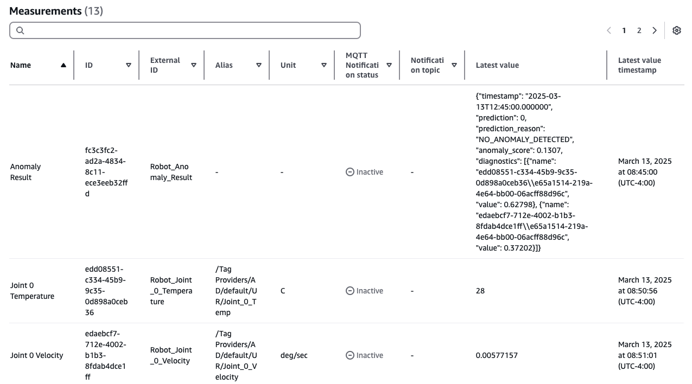
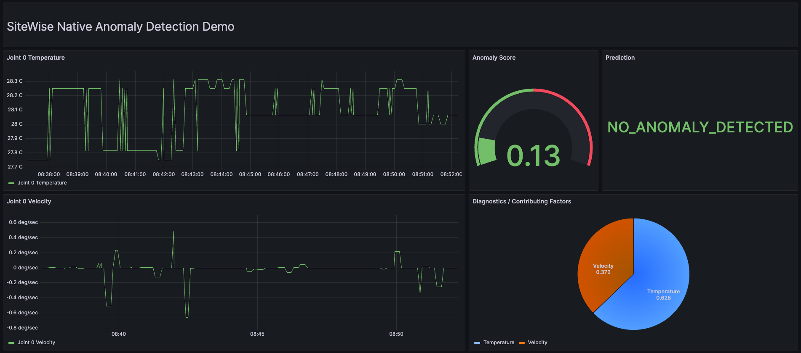
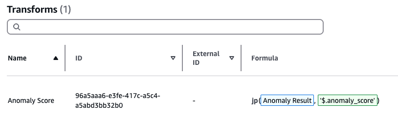
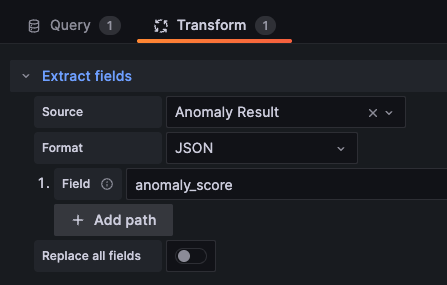

# Anomaly Detection Sample for AWS IoT SiteWise

## Table of contents
1. [About this Repo](#about-this-repo)
2. [Prerequisites](#prerequisites)
3. [How to use?](#how-to-use)
    1. [Configure the project](#1-configure-the-project)
    2. [Configure Amazon S3 buckets](#2-configure-amazon-s3-buckets)
    3. [Create asset models and assets](#3-create-asset-models-and-assets)
    4. [Import historical data](#4-import-historical-data)
    5. [Train an anomaly detection model](#5-train-an-anomaly-detection-model)
    6. [Start inferencing](#6-start-inferencing)
    7. [Simulate real-time data](#7-simulate-real-time-data)
    8. [Retrieve inference results](#8-retrieve-inference-results)
    9. [Troubleshooting](#9-troubleshooting)
4. [Clean up](#clean-up)

## About this Repo
This repository provides code samples for experimenting with the new native multi-variate anomaly detection feature in AWS IoT SiteWise. This feature simplifies the anomaly detection workflow by eliminating dependency on Amazon Lookout for Equipment service, which will no longer be available to new customers after October 17, 2024.

These code samples provide an end-to-end experience, from onboarding assets and importing historical data to training an anomaly detection model and retrieving anomaly results.

> [!WARNING]  
> This repository only supports computation models that have direct associations with assets. If you need to use computation models that are associated with asset models instead, you will need to make the necessary modifications to the repository.

This repository uses the [AWS SDK for Python (Boto3)](https://boto3.amazonaws.com/v1/documentation/api/latest/reference/services/iotsitewise.html). For the console experience of anomaly detection, please refer to [How to Get Started with AWS IoT SiteWise - Native Anomaly Detection](https://www.youtube.com/watch?v=H3jswB2pr20).

For more information, access the official [User Guide](https://docs.aws.amazon.com/iot-sitewise/latest/userguide/sitewise-anomaly-detection.html).

## Prerequisites
1. Configure [AWS credentials](https://boto3.amazonaws.com/v1/documentation/api/latest/guide/credentials.html) either using config file or shared credential file. Ensure your region is configured in the config file.
2. Clone this `Git` repository and install required Python packages by running `pip3 install -r requirements.txt`
3. Ensure Python 3 is installed on your system, you can verify by running `python3 --version` or `python --version` (on Windows).

## How to use?
### 1) Configure the project
Review the configuration in the [project_config.yml](config/project_config.yml) file and update according to your environment. If you intend to use the assets and data simulation from this repository, you just need to update the following:  
* S3 bucket names and prefixes in all the sections
* data_import &rarr; role_arn

#### Explanation of the **project_config.yml** file
<pre>
metadata_bulk_operations
|-- s3_bucket_name:  Name of the S3 bucket where definitions for metadata bulk import will be stored

data_import
|-- s3_bucket_name: Name of the S3 bucket where historical data is stored for data bulk import
|-- error_prefix: Prefix to use for error files
|-- data_prefix: Prefix to use for data files
|-- role_arn: ARN of IAM role with required permissions documented at <a href="https://docs.aws.amazon.com/iot-sitewise/latest/userguide/CreateBulkImportJob.html">Create a bulk import job.</a>

anomaly_detection
|-- asset_id: Asset ID of the target asset for anomaly detection model training
|-- input_property_ids: Property IDs of sensors to be included in the model
|-- result_property_id: Property ID of the property where anomaly result is stored
|-- computation_model_name: Name of the computation model
|-- training
    |-- data_start_time: Start time of training data range (UNIX timestamp)
    |-- data_end_time: End time of training data range (UNIX timestamp)
    |-- target_sampling_rate: Sampling rate of the data after post processing by AWS IoT SiteWise
    |-- labels
        |-- bucket_name: Name of S3 bucket where labels are stored. Leave it blank to avoid using labels.
        |-- prefix: Prefix to use for label CSV files
    |-- evaluation
        |-- bucket_name: Name of S3 bucket where model evaluation data is stored. Leave it blank to avoid using evaluation.
        |-- prefix: Prefix to use for model evaluation data files
        |-- data_start_time: Start time of evaluation data range (UNIX timestamp)
        |-- data_end_time:  End time of evaluation data range (UNIX timestamp)
|-- inference
    |-- data_delay_offset_minutes: Period of time by which inference on the data is delayed
    |-- data_upload_frequency: Frequency at which inference is executed
    |-- weekly_operating_window: Time window during which inferences are executed. Leave it blank to run on a 24/7 window.
</pre>

### 2) Configure Amazon S3 buckets
AWS IoT SiteWise anomaly detection includes data labeling and model evaluation features. Data labeling enhances model performance, while model evaluation enables SMEs to assess training results.

These features require S3 bucket permissions, which must be granted using S3 bucket policies. 

Update the S3 buckets policies as follows:
* Configure the bucket policy of labels bucket according to the [Labeling prerequisites](https://docs.aws.amazon.com/iot-sitewise/latest/userguide/anomaly-prerequisites.html#label-data)
* Configure the bucket policy of evaluation bucket according to the [Labeling prerequisites](https://docs.aws.amazon.com/iot-sitewise/latest/userguide/anomaly-prerequisites.html#prerequisites-model-evaluation)

### 3) Create asset models and assets
AWS IoT SiteWise allows you to model your equipment and processes using SiteWise asset models ("templates") and assets. You can create these resources manually one at a time. But this process could be time-consuming and prone to human errors, especially when dealing with a large number of assets.

AWS IoT SiteWise offers a capability called [bulk operations](https://docs.aws.amazon.com/iot-sitewise/latest/userguide/bulk-operations-assets-and-models.html)  that allows you to seamlessly import thousands of asset models and assets at once using console or API. 

Start a bulk import operation and create an asset hierarchy for **AnyCompany e-Bikes AD**.

    python3 src/metadata-bulk-import/import_sitewise_models_assets.py \
    >   --definitions-file-name definitions_models_assets.json

> **Note**
> You can also track the job progress using console at **AWS IoT SiteWise console** &rarr; **Build** &rarr; **Bulk operations**

Once the bulk import operation is completed, you should see the following asset hierarchy at **AWS IoT SiteWise console** &rarr; **Build** &rarr; **Assets**.

### 4) Import historical data

To train an anomaly detection model, you need to provide atleast 15 days of historical measurement data and any available labels for the welding robot. 

You will use [data bulk import](https://docs.aws.amazon.com/iot-sitewise/latest/userguide/ingest-bulkImport.html) feature of AWS IoT SiteWise to upload 30 days of historical data.

> **Must read**
> Before you can create a bulk import job, you must enable AWS IoT SiteWise warm tier or cold tier. Refer to [Configure storage settings in AWS IoT SiteWise](https://docs.aws.amazon.com/iot-sitewise/latest/userguide/configure-storage.html) for the steps.

Simulate 30 days of historical data for **Welding Robot AD** and import it into AWS IoT SiteWise. The simulated data will include temperature and velocity measurements at Joint 0.

    python3 src/data-simulation/import_historical_data.py \
    --data-file-name historical_data_sample.csv

Verify that the historical data is successfully imported. You can also verify the data using [AWS IoT SiteWise Monitor](https://docs.aws.amazon.com/iot-sitewise/latest/appguide/what-is-monitor-app.html) or [Amazon Managed Grafana](https://docs.aws.amazon.com/grafana/latest/userguide/using-iotsitewise-in-AMG.html).

If you are using data simulation from this repository, you can use the included data labels to improve the model. 

Upload the [labels_sample.csv](src/data-simulation/labels_sample.csv) file to the S3 location configured at [project_config.yml](config/project_config.yml) under **anomaly_detection** &rarr; **training** &rarr; **labels**.

### 5) Train an anomaly detection model
Now you can train an anomaly detection model for **Welding Robot AD** using the imported historical data and labels. Once trained and ready for inference, the model will start detecting abnormal behavior.

First, you create a computation model in AWS IoT SiteWise, which serves as a template for anomaly detection. Then, you can use it to train models at scale for similar assets.

Create a computation model and train an anomaly detection model for **Welding Robot AD**.

    python3 src/anomaly-detection/train_model.py

Note down the **Computation Model ID** from the response as you will need it later.

You can check the status of the training using the command below. If there is an issue with training, you could find the error message in the response for troubleshooting.

    python3 src/anomaly-detection/execution_status.py \
    --action TRAINING \
    --asset-id fc1b355e-513b-443d-9c13-51daf5bed260

If you have used labels, you can find the evaluation results file in the S3 location configured at [project_config.yml](config/project_config.yml) under **anomaly_detection** &rarr; **training** &rarr; **evaluation**.

### 6) Start inferencing

Start inference for the newly created anomaly detection model. Replace **\<value>** with Computation Model ID.

    python3 src/anomaly-detection/inference_controller.py \
    --computation-model-id <value> \
    --mode START

### 7) Simulate real-time data

Now that the anomaly detection model is ready for inference, once you ingest real-time data, AWS IoT SiteWise prepares the data and makes it available for the anomaly detection model to predict anomalies during every inference interval.

Simulate the real-time data for **Welding Robot AD**.

    nohup python3 src/data-simulation/simulate_live_data.py \
    --data-file-name historical_data_sample.csv \
    >> src/data-simulation/data_simulation.log 2>&1 &

You can verify the data ingestion using AWS IoT SiteWise console:
* Navigate to **Workshop Robot AD** asset page
* Choose **Properties** &rarr; **Measurements** &rarr; **\<Measurement>** &rarr; **Latest value timestamp**
 
### 8) Retrieve inference results

AWS IoT SiteWise stores the raw anomaly results in a user-defined property provided in the training configuration. You can access these results from AWS IoT SiteWise using [console](https://console.aws.amazon.com/iotsitewise/home), [CLI](https://docs.aws.amazon.com/cli/latest/reference/iotsitewise/), [API](https://docs.aws.amazon.com/iot-sitewise/latest/APIReference/Welcome.html), [SDK](https://aws.amazon.com/developer/tools/), [property notifications](https://docs.aws.amazon.com/iot-sitewise/latest/userguide/property-notifications.html) or [AWS IoT SiteWise plugin for Grafana](https://grafana.com/grafana/plugins/grafana-iot-sitewise-datasource/).

Check the anomaly result using console by navigating to **Build** &rarr; **Assets** &rarr; **\<Asset>** &rarr; **Anomaly Result**. It may take 5-10 minutes before you can see the anomaly result.

Following is an example Grafana dashboard showing the anomaly results (not included in this repository).

#### Understanding the results payload
AWS IoT SiteWise writes the anomaly inference results to the user-defined property. The data is written as a JSON String. 

Here is an explanation of keys from the raw result payload:
| Key      | Description |
| -------- | ------- |
| timestamp  | Timestamp of the inference record |
| prediction | Indicates equipment behavior where 0 = normal and 1 = abnormal |
| prediction_reason    | Indicates equipment behavior, NO_ANOMALY_DETECTED or ANOMALY_DETECTED |
| anomaly_score | Indicates the intensity of the anomaly, ranges between 0 and 1 |
| diagnostics    | Sensors and their contribution weights in indicating equipment behavior. Format: {"name": <ASSET_ID>\\\\<SENSOR_PROPERTY_ID>, "value": <SENSOR_CONTRIBUTION_WEIGHT> } |

#### Extracting data from the results payload
You may want to extract certain values from the raw result payload (for example, prediction anomaly_score) to trigger specific events, such as sending a notification to a machine operator.

In order to do this, you could leverage AWS IoT SiteWise [formula expressions](https://docs.aws.amazon.com/iot-sitewise/latest/userguide/formula-expressions.html) or Grafana [Transformations](https://grafana.com/docs/grafana/latest/panels-visualizations/query-transform-data/transform-data/).

**Example 1: Extract anomaly_score in AWS IoT SiteWise**

**Example 2: Extract anomaly_score in Grafana**

### 9) Troubleshooting

To troubleshooting issues related to training and inference, you could use the following commands

Check list of training executions for a given asset

    python3 src/anomaly-detection/execution_history.py \
    --asset-id fc1b355e-513b-443d-9c13-51daf5bed260 \
    --action TRAINING

Check list of inference executions for a given asset

    python3 src/anomaly-detection/execution_history.py \
    --asset-id fc1b355e-513b-443d-9c13-51daf5bed260 \
    --action INFERENCE

Check status of the latest training execution

    python3 src/anomaly-detection/execution_status.py \
    --asset-id fc1b355e-513b-443d-9c13-51daf5bed260 \
    --action TRAINING
    
Check status of the latest inference execution including the anomaly result

    python3 src/anomaly-detection/execution_status.py \
    --asset-id fc1b355e-513b-443d-9c13-51daf5bed260 \
    --action INFERENCE
    
## Clean up

You will incur costs for the resources deployed in this sample solution. If you no longer require the solution, ensure you remove the resources to avoid further charges.

    python3 src/clean-up/remove_resources.py \
    --asset-external-id Workshop_Corporate_AnyCompany_AD