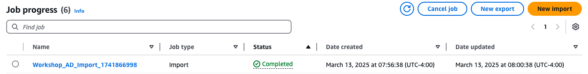
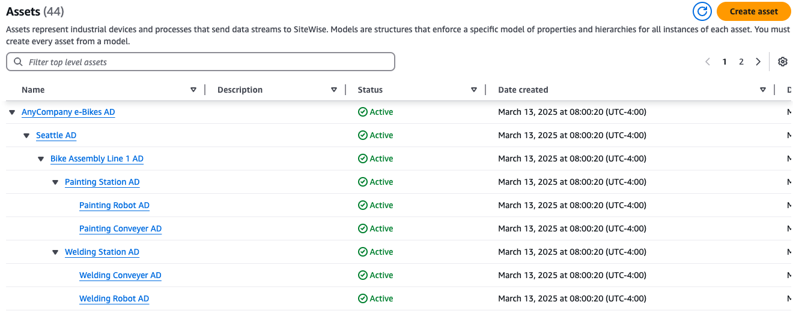
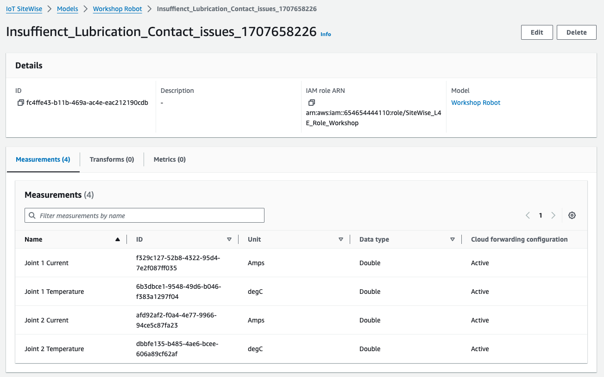
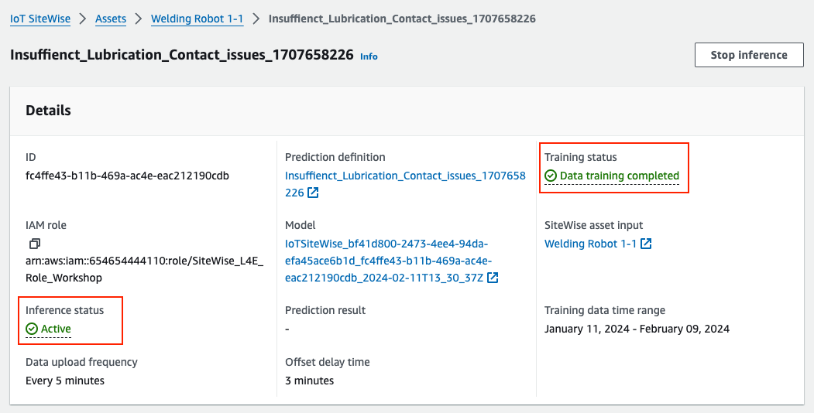
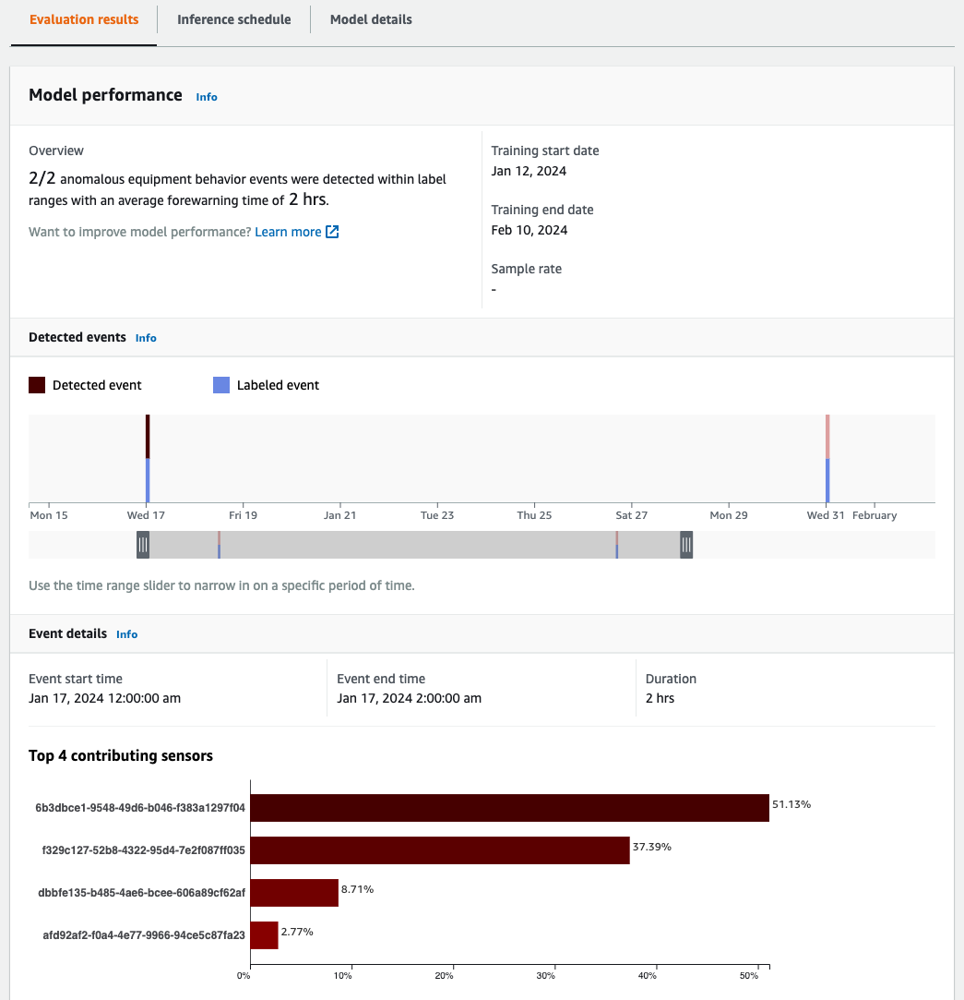

# Anomaly Detection Sample for AWS IoT SiteWise

## Table of contents
1. [About this Repo](#about-this-repo)
2. [Prerequisites](#prerequisites)
3. [How to use?](#how-to-use)
    1. [Configure the project](#1-configure-the-project)
    2. [Create asset models and assets](#2-create-asset-models-and-assets)
    3. [Import historical data](#3-import-historical-data)
    4. [Train an anomaly detection model](#4-train-an-anomaly-detection-model)
    5. [Simulate real-time data](#5-simulate-real-time-data)
    6. [Retrieve inference results](#6-retrieve-inference-results)
4. [Clean up](#4-clean-up)

## About this Repo
This repo provides code samples to experiment with the new [multi-variate anomaly detection feature offered by AWS IoT SiteWise](https://aws.amazon.com/about-aws/whats-new/2023/11/aws-iot-sitewise-multi-variate-anomaly-detection-amazon-lookout-equipment/). The feature is enabled via integration with Amazon Lookout for Equipment. 

This new integration allows customers to directly sync data between AWS IoT SiteWise and Amazon Lookout for Equipment without building a complex set of integrations or writing any code, and then easily build machine learning models directly through AWS IoT SiteWise.

The code samples provide an end-to-end experience, from onboarding assets and importing historical data to training an anomaly detection model and retrieving the anomaly results.

## Prerequisites
1. Configure [AWS credentials](https://boto3.amazonaws.com/v1/documentation/api/latest/guide/credentials.html) either using config file or shared credential file. Ensure your region is configured in the config file.
2. Clone this `Git` repository and install required Python packages by running `pip3 install -r requirements.txt`
3. Ensure Python 3 is installed on your system, you can verify by running `python3 --version` or `python --version` (on Windows).

## How to use?
### 1) Configure the project
Review the configuration in the [project_config.yml](config/project_config.yml) file and update the placeholder values.

|Parameter | Description
|:-|:-|
|`metadata_bulk_operations.s3_bucket_name` | Name of the S3 bucket where definitions for metadata bulk import will be stored
|`data_import.s3_bucket_name` | Name of the S3 bucket where historical data is stored for data bulk import
|`data_import.error_prefix` | Prefix to use for error files
|`data_import.data_prefix` | Prefix to use for data files
|`data_import.role_arn` | ARN of IAM role with required permissions documented at [Create a bulk import job](https://docs.aws.amazon.com/iot-sitewise/latest/userguide/CreateBulkImportJob.html).
|`lookout_for_equipment.s3_bucket_name` | Name of the S3 bucket where labels are stored for model training
|`lookout_for_equipment.labels_prefix` | Prefix to use for label files
|`lookout_for_equipment.role_arn` | ARN of IAM role with required permissions documented at [Detecting equipment anomalies with Amazon Lookout for Equipment](https://docs.aws.amazon.com/iot-sitewise/latest/userguide/anomaly-detection.html#ad-add-prediction-definition-cli).
|`lookout_for_equipment.action_name` | Name of the action to perform. Possible values: `AWS/L4E_TRAINING`, `AWS/L4E_TRAINING_WITH_INFERENCE` or `AWS/L4E_INFERENCE`.

### 2) Create asset models and assets
AWS IoT SiteWise allows you to model your equipment and processes using SiteWise asset models ("templates") and assets. You can create these resources manually one at a time. But this process could be time-consuming and prone to human errors, especially when dealing with a large number of assets.

AWS IoT SiteWise offers a capability called [bulk operations](https://docs.aws.amazon.com/iot-sitewise/latest/userguide/bulk-operations-assets-and-models.html)  that allows you to seamlessly import thousands of asset models and assets at once using console or API. 

Start a bulk import operation and create an asset hierarchy for **AnyCompany Motor**.

    python3 src/metadata-bulk-import/import_sitewise_models_assets.py \
    >   --definitions-file-name definitions_models_assets.json

> **Note**
> You can also track the job progress using console at **AWS IoT SiteWise console** &rarr; **Build** &rarr; **Bulk operations**

Once the bulk import operation is completed, you should see the following asset hierarchy at **AWS IoT SiteWise console** &rarr; **Build** &rarr; **Assets**.

### 3) Import historical data

To train an anomaly detection model, you need to provide atleast 15 days of historical measurement data and any available labels for the welding robot. [Labels](https://docs.aws.amazon.com/lookout-for-equipment/latest/ug/labeling-data.html) indicate periods when your equipment did not function properly.

You will use [data bulk import](https://docs.aws.amazon.com/iot-sitewise/latest/userguide/ingest-bulkImport.html) feature of AWS IoT SiteWise to upload 6 months of historical data.

> **Must read**
> Before you can create a bulk import job, you must enable AWS IoT SiteWise cold tier. Refer to [Configure storage settings for cold tier](https://docs.aws.amazon.com/iot-sitewise/latest/userguide/configure-storage-console.html) for the steps.

Simulate 30 days of historical data and labels for **Welding Robot 1-1**. The simulated data will contain periods of anomalous behaviour represented by high joint temperature (in degC) and low joint current (in amperes). Such abnormal behaviour is typically caused due to insufficient lubrication, wear in the parts, and contact issues at the robot joints.

    python3 src/data-bulk-import/simulate_historical_data.py \
    --asset-external-ids Workshop_Robot_1-1

Import the simulated historical data and labels.

    python3 src/data-bulk-import/import_historical_data.py

Verify that the historical data is successfully imported. You can also verify the data using [AWS IoT SiteWise Monitor](https://docs.aws.amazon.com/iot-sitewise/latest/appguide/what-is-monitor-app.html) or [Amazon Managed Grafana](https://docs.aws.amazon.com/grafana/latest/userguide/using-iotsitewise-in-AMG.html).

    python3 src/data-bulk-import/verify_historical_data.py

### 4) Train an anomaly detection model
Now you can train an anomaly detection model for **Welding Robot 1-1** using the imported historical data and labels. Once trained and ready for inference, the model will start detecting abnormal behavior.

First, you create an anomaly detection template in AWS IoT SiteWise, which is known as **Prediction Definition**. Then, you can use it to train an anomaly detection models at scale for similar assets.

Create a prediction definition for **Workshop_Robot** asset model and train an anomaly detection model for **Welding Robot 1-1**.

    python3 src/lookout-for-equipment/create_l4e_model.py \
    --asset-external-id Workshop_Robot_1-1

Review the newly created prediction definition:
* Navigate to **AWS IoT SiteWise console** &rarr; **Build** &rarr; **Models** &rarr; **Workshop Robot** &rarr; **Predictions**
* Choose **Insuffienct_Lubrication_Contact_issues_xxxxxxxxxx** &rarr; **Actions** &rarr; **View**

Track the training status of anomaly detection model:
* Scroll down to **Predictions**
* Choose **Welding Robot 1-1** &rarr; **Actions** &rarr; **View details**

Wait till the model is trained and ready for inference. 

To dive-deep into model training performance:
* Choose **Data training performance**  &rarr; **Lookout for Equipment**.
* Navigate to **Models** &rarr; **\<MODEL>** &rarr; **Evaluation results** 

### 5) Simulate real-time data

Now that the anomaly detection model is ready for inference, once you ingest real-time data, AWS IoT SiteWise prepares the data and makes it available for Amazon Lookout for Equipment to predict anomalies during every inference interval.

Simulate the real-time data that is representative of anomalous behaviour in joint 1 of **Welding Robot 1-1**.

    python3 src/lookout-for-equipment/simulate_real_time_data.py \
    --asset-external-id Workshop_Robot_1-1

You can verify the data ingestion using AWS IoT SiteWise console:
* Navigate to **Build** &rarr; **Assets** &rarr; **Workshop Robot 1-1**
* Choose **Properties** &rarr; **Measurements** &rarr; **\<Measurement>** &rarr; **Latest value timestamp**
 
### 6) Retrieve inference results

AWS IoT SiteWise retrieves the anomaly results from Amazon Lookout for Equipment and stores it in a property. You can access these results from AWS IoT SiteWise using [console](https://console.aws.amazon.com/iotsitewise/home), [CLI](https://docs.aws.amazon.com/cli/latest/reference/iotsitewise/), [API](https://docs.aws.amazon.com/iot-sitewise/latest/APIReference/Welcome.html), [SDK](https://aws.amazon.com/developer/tools/) or [property notifications](https://docs.aws.amazon.com/iot-sitewise/latest/userguide/property-notifications.html).

Check the anomaly result using console by navigating to **Build** &rarr; **Assets** &rarr; **\<Asset>** &rarr; **Predictions**.

Run the following to retrieve anomaly result via [Python SDK](https://boto3.amazonaws.com/v1/documentation/api/latest/reference/services/iotsitewise.html).

    python3 src/lookout-for-equipment/retrieve_anomaly_results.py \
    --asset-external-id Workshop_Robot_1-1

Here is a sample output showing the anomaly result:

    Found 1 prediction definition(s)

    Retrieving anomaly results for each prediction definition..
        Prediction definition: Insuffienct_Lubrication_Contact_issues_1707658226
            Prediction: ANOMALY_DETECTED
            Anomaly Score: 1.0
            Contributing Sensors
                Joint 2 Current: 0.9 %
                Joint 1 Current: 35.4 %
                Joint 2 Temperature: 10.0 %
                Joint 1 Temperature: 53.6 %

## 4) Clean up

You will incur costs for the resources deployed in this sample solution. If you no longer require the solution, ensure you remove the resources to avoid further charges.

Remove all resources specific to Amazon Lookout for Equipment.

    python3 src/cleanup/remove_l4e_resources.py \
        --asset-external-id Workshop_Robot_1-1

Remove all resources specific to AWS IoT SiteWise.

    python3 src/cleanup/remove_sitewise_resources.py \
        --asset-external-id Workshop_Corporate_AnyCompany